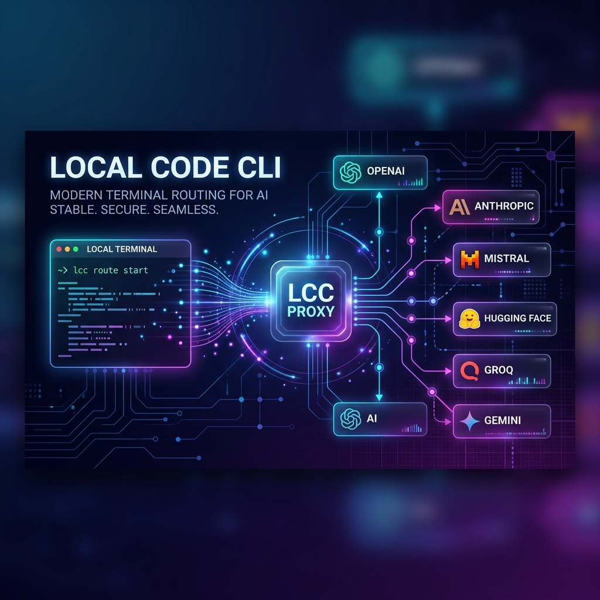
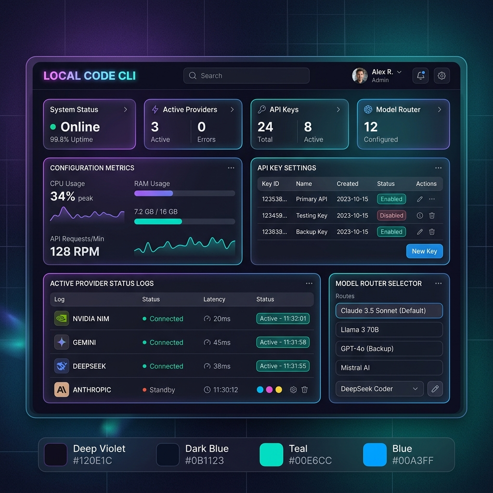

<div align="center">

# 🤖 Local Code CLI

> [!NOTE]
> **BIG tribute to [Alishahryar1/free-claude-code](https://github.com/Alishahryar1/free-claude-code)** sebagai developer sebelumnya!

Use Claude Code CLI, Codex CLI, their VS Code extensions, JetBrains ACP, or chat bots through your own provider-backed proxy.

[](https://opensource.org/licenses/MIT)
[](https://www.python.org/downloads/)
[](https://github.com/astral-sh/uv)
[](https://github.com/Corporationakht/LocalCodeCli/actions/workflows/tests.yml)
[](https://pypi.org/project/ty/)
[](https://github.com/astral-sh/ruff)
[](https://github.com/Delgan/loguru)

Local Code CLI routes Anthropic Messages API traffic from Claude Code (CLI and VS Code extension) and OpenAI Responses API traffic from Codex (CLI and VS Code extension) to any provider. It keeps each client's protocol stable while letting you choose free, paid, or local models through the same proxy and Admin UI.

[Instalasi](#%EF%B8%8F-instalasi-langkah-demi-langkah) · [Cara Pakai](#-cara-menggunakan) · [Provider](#-pilihan-provider-populer) · [VS Code](#-hubungkan-ke-vs-code) · [Bot](#-integrasi-bot-discord--telegram-opsional) · [Developer](#-menjalankan-dari-source-code-untuk-developer)

</div>

<div align="center">
  
  <p><em>Claude Code running through the Local Code CLI proxy.</em></p>
</div>

<div align="center">
  
  <p><em>Codex CLI using the local LCC Responses provider.</em></p>
</div>

<a id="model-picker"></a>

<div align="center">
  
  <p><em>Claude Code native <code>/model</code> picker with LCC gateway models.</em></p>
</div>

<div align="center">
  
  <p><em>Codex native <code>/model</code> picker with the generated LCC catalog.</em></p>
</div>

## Star History

<div align="center">
  <a href="https://star-history.com/#Corporationakht/LocalCodeCli&Date">
    <picture>
      <source media="(prefers-color-scheme: dark)" srcset="https://api.star-history.com/svg?repos=Corporationakht/LocalCodeCli&type=Date&theme=dark">
      <source media="(prefers-color-scheme: light)" srcset="https://api.star-history.com/svg?repos=Corporationakht/LocalCodeCli&type=Date">
      
    </picture>
  </a>
</div>

---

## ⚡ Apa yang Bisa Kamu Dapatkan?

Local Code CLI adalah **proksi lokal** yang bekerja di antara tool coding AI kamu (Claude Code / Codex) dengan puluhan provider model AI. Dengan ini kamu bisa:

| Fitur | Keterangan |
|---|---|
| 🔀 **Multi-Provider** | Pilih dari 17+ provider: Google Gemini (gratis!), DeepSeek, NVIDIA NIM, OpenRouter, Ollama, dll |
| 🧠 **Routing Model Cerdas** | Arahkan Opus, Sonnet, Haiku ke provider yang berbeda secara otomatis |
| 🖥️ **Admin UI Lokal** | Kelola API key dan konfigurasi lewat dasbor web di `/admin` |
| 🚀 **Launcher Siap Pakai** | Perintah `lcc-claude` dan `lcc-codex` langsung konek ke proxy |
| 🤖 **Bot Discord & Telegram** | Jalankan sesi Claude Code dari jarak jauh lewat bot chat |
| 🎤 **Transkripsi Suara** | Kirim voice note ke bot, langsung diproses sebagai prompt AI |
| 🔌 **VS Code & JetBrains** | Dukung ekstensi Claude Code dan Codex di editor favorit kamu |

---

## 🛠️ Instalasi Langkah Demi Langkah

### Langkah 1 — Instal uv dan Python 3.14 (Wajib)

Local Code CLI membutuhkan **Python 3.14** dan **uv** sebagai package manager.

**Instal uv** (kalau belum ada):

macOS/Linux:

```bash
curl -LsSf https://astral.sh/uv/install.sh | sh
```

Windows PowerShell:

```powershell
powershell -ExecutionPolicy ByPass -c "irm https://astral.sh/uv/install.ps1 | iex"
```

**Instal Python 3.14 via uv:**

```bash
uv python install 3.14
```

---

### Langkah 2 — Instal Local Code CLI

Pilih sesuai sistem operasimu:

**macOS / Linux:**

```bash
curl -fsSL "https://github.com/Corporationakht/LocalCodeCli/blob/main/scripts/install.sh?raw=1" | sh
```

**Windows PowerShell:**

```powershell
irm "https://github.com/Corporationakht/LocalCodeCli/blob/main/scripts/install.ps1?raw=1" | iex
```

> Skrip instalasi ini otomatis menginstal Claude Code dan Codex jika belum ada, lalu menginstal/memperbarui proksi Local Code CLI.
> Jalankan perintah yang **sama** untuk **update** ke versi terbaru.

Untuk menghapus Local Code CLI (tanpa menghapus uv, Claude Code, atau Codex):

macOS/Linux:

```bash
curl -fsSL "https://raw.githubusercontent.com/Corporationakht/LocalCodeCli/main/scripts/uninstall.sh" | sh
```

Windows PowerShell:

```powershell
irm "https://raw.githubusercontent.com/Corporationakht/LocalCodeCli/main/scripts/uninstall.ps1" | iex
```

---

### Langkah 3 — Dapatkan API Key Gratis

Kamu perlu minimal **satu API key** dari provider pilihanmu. Berikut yang paling mudah dan ada tier gratisnya:

| Provider | Link Daftar | Catatan |
|---|---|---|
| 🟢 **Google Gemini** | [aistudio.google.com](https://aistudio.google.com/apikey) | **100% gratis** untuk tier dasar |
| 🟡 **DeepSeek** | [platform.deepseek.com](https://platform.deepseek.com/api_keys) | Murah & powerful |
| 🟡 **OpenRouter** | [openrouter.ai/keys](https://openrouter.ai/keys) | Ada model gratis |
| 🔵 **NVIDIA NIM** | [build.nvidia.com](https://build.nvidia.com/settings/api-keys) | 1000 kredit gratis |
| ⚪ **Ollama** (lokal) | [ollama.com](https://ollama.com) | 100% offline, tidak perlu internet |

---

### Langkah 4 — Jalankan Proksi

Setelah instalasi, jalankan proksi dari terminal:

```bash
lcc-server
```

Setelah berhasil, terminal akan menampilkan output seperti ini:

```text
INFO:     Started server process
INFO:     Uvicorn running on http://0.0.0.0:8082
INFO:     Admin UI: http://127.0.0.1:8082/admin (local-only)
```

Browser akan terbuka otomatis ke **Admin UI**.

---

### Langkah 5 — Konfigurasi Provider di Admin UI

1. Buka browser ke `http://127.0.0.1:8082/admin`
2. Di bagian **Provider**, masukkan API key kamu (contoh: `GEMINI_API_KEY`)
3. Di bagian **Model**, isi nama model sesuai provider (contoh: `gemini/models/gemini-2.0-flash`)
4. Klik **Validate** → pastikan centang hijau ✅
5. Klik **Apply** → konfigurasi tersimpan otomatis ke `~/.lcc/.env`

<div align="center">
  
  <p><em>Admin UI — tempat kamu atur API key, model, dan semua konfigurasi proxy.</em></p>
</div>

---

## 🚀 Cara Menggunakan

### Menggunakan Claude Code CLI

Biarkan `lcc-server` tetap berjalan di terminal pertama, lalu buka terminal baru dan jalankan:

```bash
lcc-claude
```

> `lcc-claude` otomatis membaca port dan auth token dari Admin UI setiap kali dijalankan. Tidak perlu setting manual apapun.

Mulai percakapan dengan Claude, ketik `/model` di dalam sesi untuk berpindah model, atau `/help` untuk melihat semua perintah yang tersedia.

### Menggunakan Codex CLI

```bash
lcc-codex
```

> `lcc-codex` otomatis mendaftarkan provider lokal `lcc`, memuat katalog model dari proxy, dan menjalankan Codex. Ketik `/model` di dalam Codex untuk memilih model.

Contoh menjalankan tugas langsung dengan Codex:

```bash
lcc-codex exec "buatkan fungsi Python untuk mengurutkan array"
```

---

## 🎯 Pilihan Provider Populer

### Gratis 100% — Google Gemini

Daftar API key di [aistudio.google.com](https://aistudio.google.com/apikey), lalu isi di Admin UI:

```text
Provider    : Google Gemini
API Key     : (isi GEMINI_API_KEY)
Model       : gemini/models/gemini-2.0-flash-lite
```

### Gratis dengan Kredit — NVIDIA NIM

Daftar di [build.nvidia.com](https://build.nvidia.com/settings/api-keys) (dapat 1000 kredit gratis):

```text
Provider    : NVIDIA NIM
API Key     : (isi NVIDIA_NIM_API_KEY)
Model       : nvidia_nim/nvidia/nemotron-super-49b-v1
```

### Model Lokal Offline — Ollama

Install dan jalankan Ollama terlebih dulu:

```bash
ollama pull llama3.1
ollama serve
```

Lalu isi di Admin UI:

```text
Provider       : Ollama
Ollama Base URL: http://localhost:11434
Model          : ollama/llama3.1
```

### Routing Multi-Model (Opsional)

Kamu bisa mengatur model yang berbeda untuk setiap tier Claude agar lebih hemat:

```text
MODEL        = gemini/models/gemini-2.0-flash-lite   # fallback default
MODEL_OPUS   = nvidia_nim/moonshotai/kimi-k2.5       # untuk tugas berat
MODEL_SONNET = open_router/openrouter/free           # untuk tugas sedang
MODEL_HAIKU  = ollama/llama3.1                       # untuk tugas ringan
```

---

## 🔌 Hubungkan ke VS Code

### Claude Code Extension

1. Install ekstensi [Claude Code](https://marketplace.visualstudio.com/items?itemName=anthropic.claude-code) di VS Code
2. Buka **Settings** → cari `claude-code.environmentVariables`
3. Klik **Edit in settings.json** dan tambahkan:

```json
"claudeCode.environmentVariables": [
  { "name": "ANTHROPIC_BASE_URL", "value": "http://localhost:8082" },
  { "name": "ANTHROPIC_AUTH_TOKEN", "value": "freecc" },
  { "name": "CLAUDE_CODE_ENABLE_GATEWAY_MODEL_DISCOVERY", "value": "1" },
  { "name": "CLAUDE_CODE_AUTO_COMPACT_WINDOW", "value": "190000" }
]
```

4. Reload VS Code — selesai! ✅

Jika ekstensi menampilkan layar login, pilih jalur Anthropic Console sekali saja — setelah variabel environment aktif, proxy tetap menangani semua traffic model.

### Codex Extension

1. Install ekstensi [Codex](https://marketplace.visualstudio.com/items?itemName=openai.chatgpt) di VS Code
2. Buat atau edit file `~/.codex/config.toml` (`%USERPROFILE%\.codex\config.toml` di Windows):

```toml
model_provider = "lcc"
model = "gemini/models/gemini-2.0-flash"

[model_providers.lcc]
name = "Local Code CLI"
base_url = "http://127.0.0.1:8082/v1"
env_key = "LCC_CODEX_API_KEY"
wire_api = "responses"
```

3. Buat file `~/.codex/auth.json`:

```json
{ "LCC_CODEX_API_KEY": "freecc" }
```

4. Restart VS Code — Codex akan langsung menggunakan provider `lcc`. ✅

---

## 🤖 Integrasi Bot Discord & Telegram (Opsional)

Kamu bisa menjalankan sesi Claude Code dari mana saja lewat bot chat!

### Setup

1. Jalankan `lcc-server`
2. Buka Admin UI → pilih menu **Messaging**
3. Pilih platform: **Discord** atau **Telegram**
4. Masukkan bot token dan channel/user ID yang diizinkan
5. Atur **Allowed Directory** ke folder proyek kamu
6. Klik **Validate** → **Apply**

### Perintah Bot yang Tersedia

| Perintah | Fungsi |
|---|---|
| `/stop` | Hentikan task yang sedang berjalan |
| `/clear` | Reset sesi dan mulai dari awal |
| `/stats` | Lihat status penggunaan sesi |

### Transkripsi Voice Note (Opsional)

Aktifkan Whisper lokal atau NVIDIA NIM ASR di bagian **Voice** pada Admin UI. Setelah aktif, kamu bisa kirim pesan suara ke bot dan otomatis ditranskripsi jadi prompt teks.

---

## 🔧 Menjalankan dari Source Code (Untuk Developer)

Jika kamu ingin berkontribusi atau menjalankan langsung dari kode sumber:

```bash
# Clone repositori
git clone https://github.com/Corporationakht/LocalCodeCli.git
cd LocalCodeCli

# Jalankan server langsung (development mode)
uv run uvicorn server:app --host 0.0.0.0 --port 8082 --reload
```

### Menjalankan Pengujian (CI)

```bash
# macOS/Linux
./scripts/ci.sh

# Windows PowerShell
.\scripts\ci.ps1
```

Perintah ini menjalankan semua pemeriksaan secara berurutan: format kode (ruff format), linter (ruff check), type check (ty), dan 1600+ unit test (pytest). Pastikan semua lulus sebelum membuka Pull Request.

Kamu juga bisa menjalankan satu cek saja:

```bash
# Format saja
uv run ruff format

# Linter saja
uv run ruff check

# Type check saja
uv run ty check

# Test saja
uv run pytest -v --tb=short
```

### Struktur Proyek

```text
LocalCodeCli/
├── server.py              # Entry point ASGI
├── api/                   # Route FastAPI, Admin UI, dan logika layanan
├── core/                  # Helper protokol Anthropic, SSE, OpenAI Responses
├── providers/             # Transport provider, registry, rate limiting
├── messaging/             # Adapter Discord/Telegram, sesi, voice
├── cli/                   # Entrypoint paket dan manajemen proses CLI
├── config/                # Pengaturan, katalog provider, logging
├── scripts/               # Skrip instalasi, uninstalasi, dan CI
└── tests/                 # Unit test dan contract test
```

### Menambah Provider Baru

- Implementasikan interface transport di `providers/`
- Daftarkan metadata provider di `config/provider_catalog`
- Daftarkan factory di `providers/registry`

### Menambah Platform Messaging Baru

- Implementasikan interface `MessagingPlatform` di `messaging/`

---

## ❓ FAQ

**Q: Apakah ini aman? Apakah data saya dikirim ke pihak ketiga?**

A: Proksi berjalan 100% di komputer lokalmu. Data hanya dikirim ke provider AI yang kamu pilih sendiri (Gemini, DeepSeek, dll.), persis seperti kalau kamu pakai API mereka langsung. Tidak ada data yang melewati server pihak ketiga lain.

**Q: Apakah bisa pakai gratis?**

A: Ya! Gunakan Google Gemini (free tier dengan kuota harian), OpenRouter (ada model gratis), atau Ollama (model lokal 100% offline dan gratis tanpa batas).

**Q: Apakah bisa dipakai di Windows?**

A: Tentu! Local Code CLI mendukung Windows, macOS, dan Linux. Skrip instalasi tersedia untuk semua platform.

**Q: Apa bedanya `lcc-server` dengan `fcc-server`?**

A: `lcc-server` adalah nama perintah baru di Local Code CLI ini (LCC = Local Code CLI). `fcc-server` tetap tersedia sebagai alias mundur (*backward compatibility*) untuk pengguna yang sudah terbiasa dengan nama lama.

**Q: File konfigurasi disimpan di mana?**

A: Di folder `~/.lcc/.env` pada macOS/Linux, atau `%USERPROFILE%\.lcc\.env` pada Windows. Semua perubahan dari Admin UI otomatis tersimpan di sana.

**Q: Bagaimana cara ganti port default (8082)?**

A: Di Admin UI bagian **General**, ubah nilai `PORT`. Restart `lcc-server` agar perubahan aktif.

---

## 🤝 Kontribusi

Kontribusi sangat disambut! Sebelum membuka Pull Request:

- Pastikan perubahan kamu dilengkapi dengan pengujian yang relevan (termasuk edge case)
- Jalankan `./scripts/ci.sh` (atau `.\scripts\ci.ps1` di Windows) dan pastikan semua 5 cek lulus
- Buat perubahan yang kecil dan terfokus — satu PR untuk satu perubahan
- Jangan buka PR khusus untuk perubahan README; buka issue saja
- Laporkan bug di [Issues](https://github.com/Corporationakht/LocalCodeCli/issues) — sertakan model mapping, nama model saat bug terjadi, dan pesan error lengkap

---

## 📄 Lisensi

MIT License — bebas digunakan, dimodifikasi, dan didistribusikan. Lihat [LICENSE](LICENSE) untuk detail lengkapnya.
